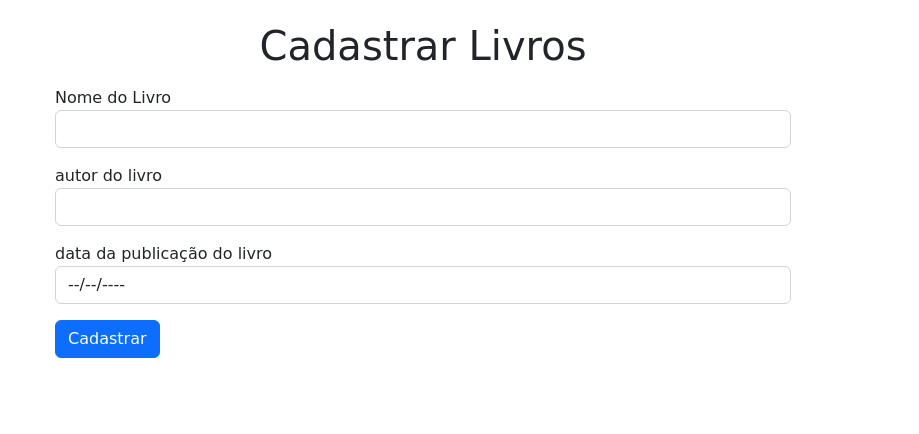
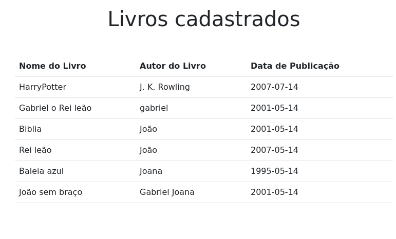

 
# Desafio Up Estágio 🤺      

 
 

## 🚀 Tecnologias 🚀

<ul>
    <li>React ou Vue.js ou Angular</li>
    <li>Node.js</li>
    <li>MongoDB</li>
</ul>
 
 

## 🛠 Desafio 🛠

A Biblioteca Nacional de Brasília deseja desenvolver um novo sistema interno e você foi contratado para fazer duas telas do sistema (Frontend e Backend).

- Frontend:
    * tela 1
        * Formulário para cadastro de livros
        * Informações:
            * O formulário terá os seguintes campos: Nome do Livro, Autor do livro, Data de publicação do livro.

    * tela 2
        * Uma Tabela para visualizar os Livros cadastrados.

- Backend:
    * Deverá ser construído uma API usando node.js e MongoDB. A API terá que coletar os dados do formulário, cadastrar no banco de dados MongoDB e depois trazer esses dados para a Tabela (Tela 2)
    .

Imagens Exemplos:

<table>
    <tr>
        <td>Modelo Exemplo - cadastro de livros</td>
        <td>Modelo Exemplo - lista de livros cadastrados</td>
    </tr>
    <tr>
        <td></td>
        <td></td>
    </tr>
</table>

 
 

## 📒 Instruções finais 📒

* O Desafio deverá ser colocado em um repositorio no GitHub do candidato.
* O Projeto deve conter um README, onde vai ser posto a documentação do projeto contendo as instruções para executar o sistema.
* Dica - Utilize o MongoDB Atlas

